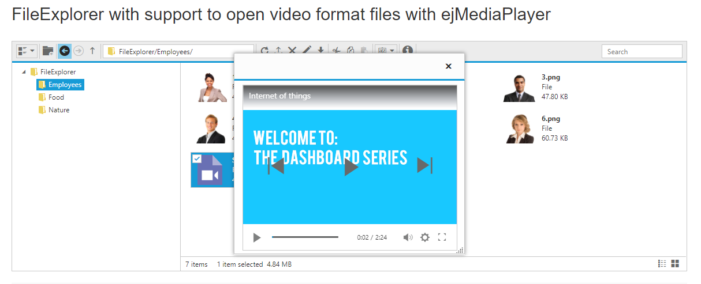

# EJ1 FileExplorer with ejMediaPlayer integration to play video files

This project demonstrates on how to play video files in FileExplorer using ejMediaPlayer component. This can be achieved by customizing ejMediaPlayer in application-level with the help of FileExplorer BeforeOpen event.

## How to run this application?

To run this application, you need to first clone the `ej1-FileExplorer-with-MediaPlayer-integration-to-play-video-files` repository and then navigate to its appropriate path where it has been located in your system.

To do so, open the command prompt and run the below commands one after the other.

```
git clone https://github.com/SyncfusionExamples/ej1-FileExplorer-with-MediaPlayer-integration-to-play-video-files FE_MediaPlayer
cd FE_MediaPlayer
```

## Running application

Once cloned, open solution file in visual studio.Then build the project after restoring the nuget packages and run it.

## Final Output

